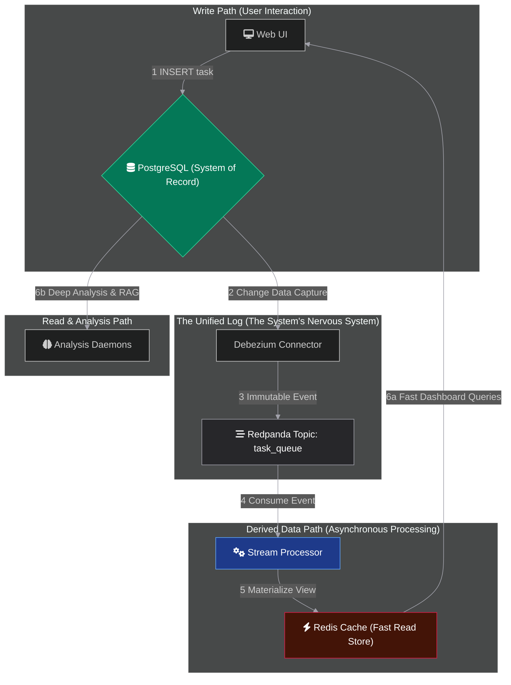
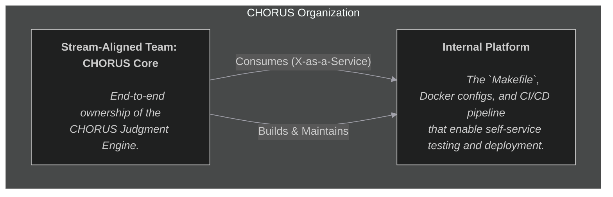

### Filename: `README.md`

<p align="center">
  <a href="#">
    
  </a>
</p>

> ✨ **The loudest secrets are kept in silence. We built an engine that listens.**
>
> We believe that silence is not an absence of data, but a signal in itself. A budget line vanishes into shadow. A job posting for a cleared physicist appears like a flare in the night. A cluster of obscure academic papers creates a new hum in the noise.
>
> CHORUS is an observatory for these echoes. It is a fully autonomous, self-healing, and evolving intelligence platform designed to fuse disparate, open-source data verticals into a single, coherent revelation. It does not give you an answer; it delivers a **verdict**.

<p align="center">
  
  
  
</p>

---

### 🏛️ The Architecture in Four Views

To comprehend CHORUS is to view it through four distinct lenses, each revealing a different layer of its soul.

<br>

#### 🧠 **View I: The Judgment Process**

_This is the **why** of the system: the logical flow of how an AI council debates and synthesizes a query into a final verdict._

```mermaid
%%{init: {'theme': 'dark', 'themeVariables': { 'primaryColor': '#14b8a6', 'primaryTextColor': '#ffffff', 'lineColor': '#a1a1aa'}}}%%
graph TD
    subgraph "Tier 0: The Query"
        A[User Query]
    end

    subgraph "Tier 1: The Analyst Wing (Parallel Analysis)"
        direction LR
        style AnalystTier fill:#1e293b,stroke:#334155

        subgraph AnalystTier[ ]
            P1["<i class='fa fa-user-secret'></i> Analyst Hawk"]
            P2["<i class='fa fa-user-secret'></i> Analyst Dove"]
            P3["<i class='fa fa-user-secret'></i> Analyst Skeptic"]
            P4["<i class='fa fa-user-secret'></i> Analyst Futurist"]
        end

        R1[Preliminary Report 1]
        R2[Preliminary Report 2]
        R3[Preliminary Report 3]
        R4[Preliminary Report 4]

        P1 --> R1
        P2 --> R2
        P3 --> R3
        P4 --> R4
    end

    subgraph "Tier 2: The Director's Synthesis"
        style Director fill:#0f766e,stroke:#14b8a6
        Director("<i class='fa fa-user-tie'></i> Director Alpha") --> Briefing{Director's Briefing}
    end

    subgraph "Tier 3: The Final Verdict"
        style Judge fill:#be123c,stroke:#f43f5e
        Judge("<i class='fa fa-gavel'></i> Judge Prime") --> Verdict([Final Verdict])
    end

    A --> AnalystTier
    R1 & R2 & R3 & R4 --> Director
    Briefing --> Judge

    classDef persona fill:#083344,stroke:#0e7490,color:#e0f2fe
    class P1,P2,P3,P4 persona;
```


````

#### ⚙️ **View II: The Dataflow Engine**

_This is the **how** of the system: the physical infrastructure and data's journey through our containerized, event-driven services._



#### 🛠️ **View III: The Development Praxis**

_This is **how we trust** the system: the `Makefile`-driven workflow that separates rapid iteration from hermetic verification._

```mermaid
%%{init: {'theme': 'dark', 'themeVariables': { 'primaryColor': '#d946ef', 'primaryTextColor': '#ffffff', 'lineColor': '#a1a1aa'}}}%%
graph LR
    subgraph "Developer's Machine"
        Dev(Developer) -- "Edits Code" --> Editor[<i class='fa fa-code'></i> IDE / Code Editor]
    end

    subgraph "Fast Loop (95% of workflow)"
        style FastLoop fill:#1e293b,stroke:#334155
        subgraph FastLoop [ ]
            Dev -- "1 `make run-dev`" --> C[Running Containers]
            Editor -.-> C
            Dev -- "2 `make test-fast`" --> T1(Fast Tests)
            T1 -- "Asserts against" --> C
        end
    end

    subgraph "Verification & Release"
        style VerificationLoop fill:#450a0a,stroke:#be123c
        subgraph VerificationLoop [ ]
            Editor -- "git commit -m 'feat: ...'" --> PR(Pull Request)
            PR -- "Triggers" --> CI(CI/CD Gatekeeper)
            CI -- "Runs `make test`" --> T2(Hermetic Test Suite)
            T2 -- "On Success" --> Merge(Merge to Main)
        end
    end
```



#### 🌀 **View IV: The Team Topology**

_This is **how we organize** for flow: as a single, stream-aligned team building and consuming our own internal platform._



---

### 🚀 Your First Session

Ready to join the chorus? Here’s how to get the engine running.

**Prerequisites:** Git, Docker & Docker Compose.

**Step 1: Clone & Configure** 🧬

```bash
# Clone the repository and enter the directory
git clone <your-repo-url>
cd CHORUS

# Create your personal environment file for development
cp .env.dev .env

# Add your API keys to the new .env file
nano .env
```

**Step 2: Build & Launch** 🛰️

```bash
# This single command builds the base image and starts all services.
# The first run will be slow; subsequent runs will be fast.
make run-dev
```

**Step 3: Observe** 🔭

- **CHORUS C2 UI:** `http://localhost:5002`
- **Redpanda Console:** `http://localhost:8081`

**Step 4: Power Down** 🔌

```bash
# Stop and remove all running containers and volumes for the dev environment.
make stop-dev
```

---

### 📜 Our Guiding Philosophy

Development on CHORUS is not arbitrary. It is a disciplined practice guided by a set of foundational documents that define our mission, our architecture, and our commitment to verification.

- **The Constitution:** The supreme law governing the system's design and mission.
- **The Development Protocol:** The supreme law governing how we build, test, and release software.

Before contributing, we ask that you read these documents in the `/docs` directory to understand the principles that make CHORUS possible.

---

### 🤝 Answering the Call

Contributions are welcome, but they are judged against the high standards set forth in our canonical documents. If you are ready to build a system of judgment, we are ready to hear your voice.

---

### 📄 License

This project is licensed under the MIT License. See the [LICENSE](LICENSE) file for details.
