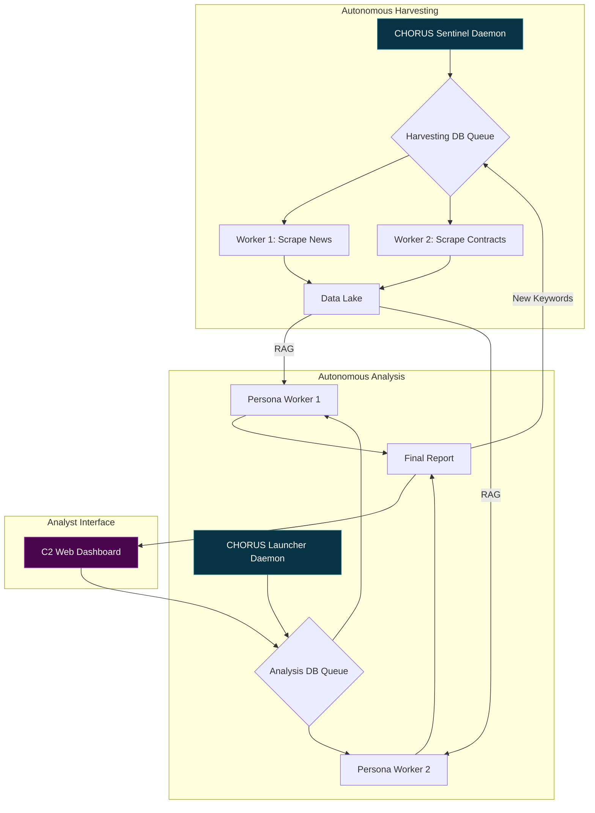

# 🔱 CHORUS: Listening to the Silence Between the Signals

> ✨ *The loudest secrets are kept in silence. We built an engine that listens.* ✨

---

## Overview

**CHORUS** is not a search engine; it is a judgment engine. It is a fully autonomous, self-healing, and evolving intelligence platform designed to fuse disparate, open-source data verticals into high-fidelity, actionable insights.

The system was born from a simple observation: when a government research program proves its worth, it doesn't die—it "graduates" into the classified world, leaving behind a faint echo in the public record. CHORUS is designed to detect these echoes by correlating the silence in one dataset with the sudden chatter in others. It connects the dots between a DARPA program going dark, a surge in contract awards to a specific company, a spike in demand for cleared engineers with unique skills, and the global conversation surrounding a new technology.

By simulating the adversarial, multi-perspective analysis of a real-world intelligence agency, CHORUS moves beyond data retrieval into the realm of automated strategic judgment.

## Core Features

-   **Autonomous & Self-Healing:** Built on a service-oriented architecture with `systemd`-managed daemons, the system runs 24/7, survives reboots, and automatically manages its own data collection and analysis queues.
-   **Evolving Data Lake:** A "fire-and-forget" **Sentinel** process periodically and intelligently refreshes all seven data sources, ensuring the system's knowledge is never stale.
-   **Multi-Source Fusion:** Ingests and correlates data from seven distinct verticals:
    1.  **DARPA Budgets:** The primary signal for strategic intent.
    2.  **USAspending.gov:** The money trail to corporate contractors.
    3.  **Job Postings:** The human capital trail for specialized skills.
    4.  **GovInfo (CRS/USCODE):** The foundational legal and policy context.
    5.  **arXiv.org:** The bleeding edge of academic and scientific research.
    6.  **NewsAPI:** The commercial and financial signal from private industry.
    7.  **GDELT:** The global narrative from worldwide news media.
-   **Adversarial AI Council:** A "Chorus" of 16 different AI analysts and 4 directors debate and challenge findings, preventing groupthink and ensuring intellectual rigor.
-   **Verifiable Attribution:** Every claim in the final report is linked to its source with clickable citations, ensuring academic-grade verifiability.
-   **Dual-Format Export:** Generate final intelligence products as either a portable static HTML website or a professional, archival-quality PDF.
-   **Living Documentation:** The entire system is self-documenting, with a live documentation website generated directly from the codebase.

## System Architecture

CHORUS operates as two parallel, autonomous systems that feed each other: The **Sentinel** (Data Harvesting) and the **Launcher** (Data Analysis).



      
## Setup & Installation

CHORUS is designed to be run on a Debian-based Linux system.

### 1. Prerequisites
- Python 3.10+
- MariaDB (or MySQL)
- `git`
- `pandoc`
- **A LaTeX Distribution (for PDF export)**

```bash
sudo apt-get update
sudo apt-get install -y python3-pip python3-venv mariadb-server git pandoc texlive-xetex

    
2. Clone the Repository
Generated bash

      
git clone <your-repo-url>
cd Chorus

    
3. Create and Activate Virtual Environment

This project requires a Python virtual environment to ensure dependencies do not conflict with your system's Python installation.
Generated bash

      
# Create the virtual environment
python3 -m venv venv

# Activate it (you must do this every time you open a new terminal to work on the project)
source venv/bin/activate


4. Install Dependencies

Once your virtual environment is active, install the required packages.
Generated bash

      
pip install -r requirements.txt


5. Configure the Environment

Copy the example configuration file and fill in your credentials. The .env file is ignored by Git and will not be committed.
Generated bash

      
cp .env.example .env
nano .env

    
You will need to get free API keys from:

    Google AI Studio

    NewsAPI.org

    GovInfo API

6. Set Up the Database

```

