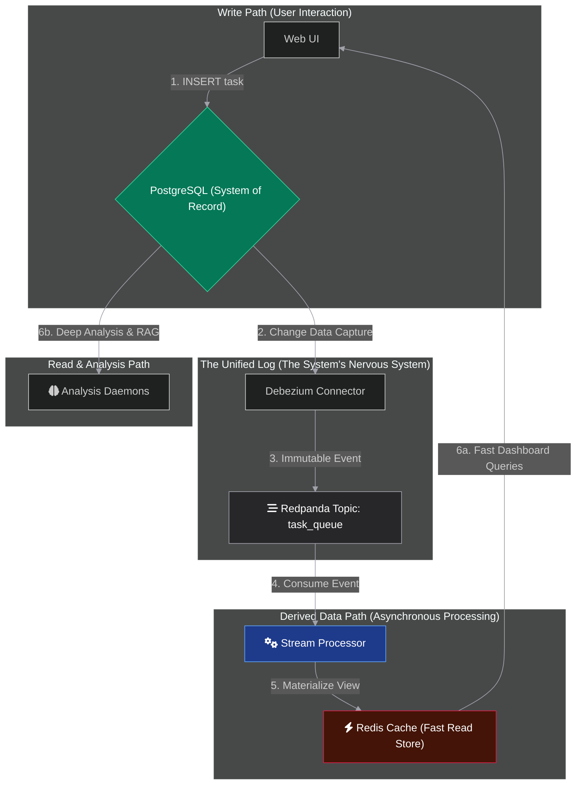
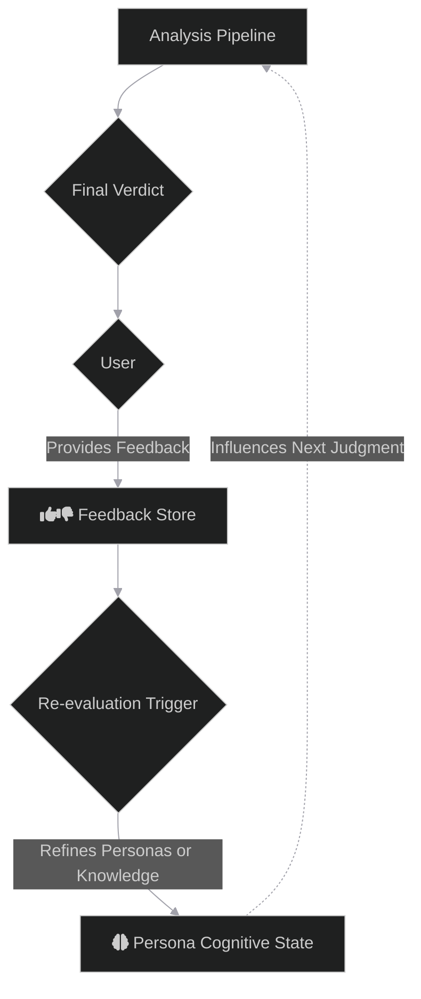

```mermaid
%%{init: {'theme': 'dark', 'themeVariables': { 'primaryColor': '#d946ef', 'primaryTextColor': '#ffffff', 'lineColor': '#a1a1aa'}}}%%
graph LR
    subgraph "Developer's Machine"
        Dev(Developer) -- "Edits Code" --> Editor[<i class='fa fa-code'></i> IDE / Code Editor]
    end

    subgraph "Fast Loop (95% of workflow)"
        style FastLoop fill:#1e293b,stroke:#334155
        subgraph FastLoop [ ]
            Dev -- "1. `make run`" --> C[Running Containers]
            Editor -.-> C
            Dev -- "2. `make test-fast`" --> T1(Fast Tests)
            T1 -- "Asserts against" --> C
        end
    end
    
    subgraph "Slow Loop (On Dependency Change)"
        style SlowLoop fill:#4a044e,stroke:#a21caf
        subgraph SlowLoop [ ]
            Dev -- "`make rebuild`" --> B(Build Image) --> C2[Restart Containers]
        end
    end

    subgraph "Verification Loop (CI/CD)"
        style VerificationLoop fill:#450a0a,stroke:#be123c
        subgraph VerificationLoop [ ]
            CI(CI/CD Server) -- "`make test`" --> T2(Hermetic Test Suite)
        end
    end
```

# 🔱 CHORUS: The Judgment Engine

> ✨ _The loudest secrets are kept in silence. We built an engine that listens._ ✨

<p align="center">
  
  
  
</p>

---

## 1. Core Concepts & Architectural Views

The CHORUS engine is a complex system best understood by viewing it through three distinct architectural lenses:

1.  **The Judgment Process:** The logical flow of how an AI council debates and synthesizes a query into a final verdict. This is the *why* of the system.
2.  **The Dataflow Engine:** The physical infrastructure and data's journey through our containerized, event-driven services. This is the *how* of the system.
3.  **The Development Praxis:** The workflow that developers use to build, verify, and maintain the system, governed by our `Makefile`. This is *how we trust* the system.

The following diagrams illustrate each of these views.

---

## 2. The Judgment Process: The Adversarial Council

This diagram illustrates the logical flow of analysis. A user's query is not answered directly; it is subjected to a multi-tiered, adversarial debate between specialized AI personas.


---

## 3. The Dataflow Engine: The Unbundled Database

This diagram shows the physical infrastructure. It illustrates how data flows through our containerized services, from the initial write in the database to the final materialized views in the cache.



---

## 4. The Development Praxis: The Dual-Mode Harness

This diagram explains the `Makefile`-driven development workflow, which is central to our engineering philosophy. It separates the rapid, iterative "Fast Loop" from the slow, hermetic "Verification Loop."



---

## 5. The Systemic Learning Loop: The Path to Recursion

This diagram illustrates the future-state goal of the CHORUS engine: to learn from its own judgments. This represents the highest level of abstraction and the system's capacity for recursion.



---

## 6. Getting Started

### Prerequisites

-   **Git:** For cloning the repository.
-   **Docker & Docker Compose:** For running the entire containerized environment.
-   **An IDE:** For editing code on your host machine.

### 1. Initial Setup

```bash
# Clone the repository and navigate into it
git clone <your-repo-url>
cd CHORUS

# Create your personal environment file from the template
cp .env.example .env

# Open .env with your editor and add your GOOGLE_API_KEY
# and any other required API keys (e.g., USAJOBS_API_KEY).
# nano .env
```

### 2. Build and Run the System

This single command builds the Docker images (a one-time slow operation) and starts all services in development mode with live code reloading.

```bash
# This command will stop, build, and start the entire stack.
make rebuild
```

Subsequent starts can use the faster `make run` command.

### 3. Access the System

-   **CHORUS C2 UI:** [http://localhost:5001](http://localhost:5001)
-   **Redpanda Console (Kafka UI):** [http://localhost:8080](http://localhost:8080)

### 4. Shut Down the System

```bash
# Stop and remove all running containers and volumes.
make stop
```

## 7. Contributing

Contributions are welcome but must adhere to the project's foundational principles. All development is guided by a strict set of axioms designed to ensure quality, consistency, and architectural integrity.

Before contributing, please familiarize yourself with the canonical documents in the `/docs` directory:
1.  **`01_CONSTITUTION.md`**: The supreme law governing the system's design and non-verification principles.
2.  **`04_VERIFICATION_COVENANT.md`**: The supreme law governing how we prove our work is correct.

## 8. License

This project is licensed under the MIT License. See the [LICENSE](LICENSE) file for details.
