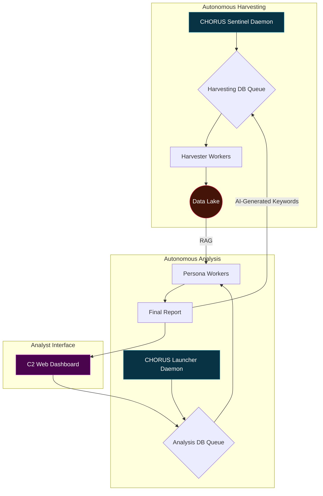
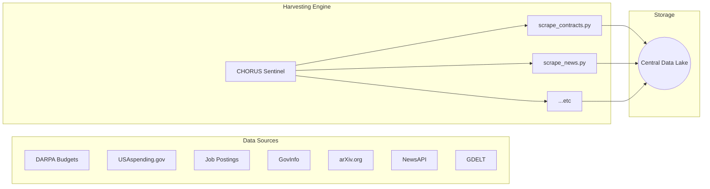
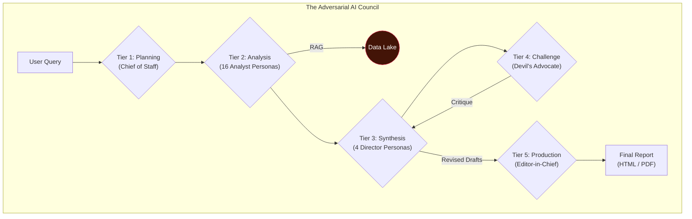

# 🔱 CHORUS: Listening to the Silence Between the Signals

> ✨ *The loudest secrets are kept in silence. We built an engine that listens.* ✨

---

## Overview

**CHORUS** is not a search engine; it is a judgment engine. It is a fully autonomous, self-healing, and evolving intelligence platform designed to fuse disparate, open-source data verticals into high-fidelity, actionable insights.

The system was born from a simple observation: when a government research program proves its worth, it doesn't die—it "graduates" into the classified world, leaving behind a faint echo in the public record. CHORUS is designed to detect these echoes by correlating the silence in one dataset with the sudden chatter in others. It connects the dots between a DARPA program going dark, a surge in contract awards to a specific company, a spike in demand for cleared engineers with unique skills, and the global conversation surrounding a new technology.

By simulating the adversarial, multi-perspective analysis of a real-world intelligence agency, CHORUS moves beyond data retrieval into the realm of automated strategic judgment.

## Core Features

-   **Autonomous & Self-Healing:** Built on a service-oriented architecture with `systemd`-managed daemons, the system runs 24/7, survives reboots, and automatically manages its own data collection and analysis queues.
-   **Evolving Data Lake:** A "fire-and-forget" **Sentinel** process periodically and intelligently refreshes all seven data sources, ensuring the system's knowledge is never stale.
-   **Multi-Source Fusion:** Ingests and correlates data from seven distinct verticals:
    1.  **DARPA Budgets:** The primary signal for strategic intent.
    2.  **USAspending.gov:** The money trail to corporate contractors.
    3.  **Job Postings:** The human capital trail for specialized skills.
    4.  **GovInfo (CRS/USCODE):** The foundational legal and policy context.
    5.  **arXiv.org:** The bleeding edge of academic and scientific research.
    6.  **NewsAPI:** The commercial and financial signal from private industry.
    7.  **GDELT:** The global narrative from worldwide news media.
-   **Adversarial AI Council:** A "Chorus" of 16 different AI analysts and 4 directors debate and challenge findings, preventing groupthink and ensuring intellectual rigor.
-   **Verifiable Attribution:** Every claim in the final report is linked to its source with clickable citations, ensuring academic-grade verifiability.
-   **Dual-Format Export:** Generate final intelligence products as either a portable static HTML website or a professional, archival-quality PDF.
-   **Living Documentation:** The entire system is self-documenting, with a live documentation website generated directly from the codebase.

---
## System Architecture

CHORUS is a decoupled, service-oriented system composed of three primary components: the **Data Lake**, the **Analysis Core**, and the **Analyst Interface**. These components work in a continuous, self-sustaining loop.

### The CHORUS Ecosystem

This diagram illustrates the high-level interaction between the system's autonomous parts. The Sentinel perpetually harvests data, the Launcher perpetually analyzes it, and the Analyst commands the process through the C2 Dashboard, creating a virtuous cycle of intelligence.



### The Evolving Data Lake

The Sentinel daemon is responsible for populating and maintaining a diverse, seven-source data lake. It runs specific scrapers on a schedule, ensuring the data is never stale. This provides the rich, multi-vertical context required for high-fidelity analysis.



### The Adversarial AI Council

This is the analytical heart of CHORUS. Instead of a single AI, a multi-tier "Council of Personas" processes information. This structured, adversarial workflow ensures conclusions are rigorously tested from multiple viewpoints before being finalized, complete with verifiable, clickable source citations.



---
## Setup & Installation

CHORUS is designed to be run on a Debian-based Linux system.

### 1. Prerequisites
- Python 3.10+
- MariaDB (or MySQL)
- `git`
- `pandoc`
- **A LaTeX Distribution (for PDF export)**

```bash
sudo apt-get update
sudo apt-get install -y python3-pip python3-venv mariadb-server git pandoc texlive-xetex
```

### 2. Clone the Repository
```bash
git clone <your-repo-url>
cd Chorus
```

### 3. Create and Activate Virtual Environment
This project requires a Python virtual environment to ensure dependencies do not conflict with your system's Python installation.
```bash
# Create the virtual environment
python3 -m venv venv

# Activate it (you must do this every time you open a new terminal to work on the project)
source venv/bin/activate
```

### 4. Install Dependencies
Once your virtual environment is active, install the required packages.
```bash
pip install -r requirements.txt
```

### 5. Configure the Environment
Copy the example configuration file and fill in your credentials. **The `.env` file is ignored by Git and will not be committed.**
```bash
cp .env.example .env
nano .env
```
You will need to get free API keys from:
- [Google AI Studio](https://aistudio.google.com/app/apikey)
- [NewsAPI.org](https://newsapi.org/)
- [GovInfo API](https://api.govinfo.gov/)

### 6. Set Up the Database
Log into MariaDB and create the database and user specified in your `.env` file.
```sql
-- Example Commands:
CREATE DATABASE chorus_analysis;
CREATE USER 'chorus_user'@'localhost' IDENTIFIED BY 'your_secure_db_password';
GRANT ALL PRIVILEGES ON chorus_analysis.* TO 'chorus_user'@'localhost';
FLUSH PRIVILEGES;
```
Then, run the schema creation script:
```bash
mysql -u $(grep DB_USER .env | cut -d '=' -f2) -p $(grep DB_PASSWORD .env | cut -d '=' -f2) $(grep DB_NAME .env | cut -d '=' -f2) < scripts/schema.sql
```

### 7. The Data-First Build Process

**Step A: The DARPA Ingestion (One-Time)**
- Place your raw DARPA `.txt` files into the `data/darpa/` directory.
- Run the ingestion pipeline:
```bash
cd scripts
python ingest_1_dictionaries.py
python ingest_2_encode.py
python ingest_3_generate_dsv.py
```

**Step B: Launch the Autonomous Harvester**
- Populate the harvesting queue:
```bash
python populate_harvest_tasks.py
```
- Deploy the Sentinel daemon as a `systemd` service. This will begin collecting all other data sources in the background.

**Step C: Launch the Analysis Engine**
- Populate the personas table:
```bash
mysql -u $(grep DB_USER .env | cut -d '=' -f2) -p $(grep DB_PASSWORD .env | cut -d '=' -f2) $(grep DB_NAME .env | cut -d '=' -f2) < scripts/populate_personas.sql
```
- Deploy the main CHORUS launcher as a `systemd` service.

### 8. Launch the C2 Dashboard & Documentation

- **To run the main application UI:**
  ```bash
  # From the scripts/ directory
  python web_ui.py
  ```
  Navigate to `http://127.0.0.1:5001`.

- **To view the live code documentation:**
  ```bash
  # From the scripts/ directory
  python generate_and_serve_docs.py
  ```
  Navigate to `http://localhost:8001`.

## My Findings
*(This section is for you to document the most compelling insights your CHORUS engine discovers.)*

**Example Finding:**
> By correlating a spike in DARPA funding for "Program X" in FY22 with a cluster of contract awards to "Company Y" in Q3 FY22 and a subsequent surge in job postings from Company Y for "RF engineers with TS/SCI clearances" in Q4 FY22, CHORUS assesses with high confidence that Program X involves the development of a new, classified radio-frequency satellite communication system. This was corroborated by a GDELT analysis showing increased discussion of satellite communications in Chinese state media during the same period.
