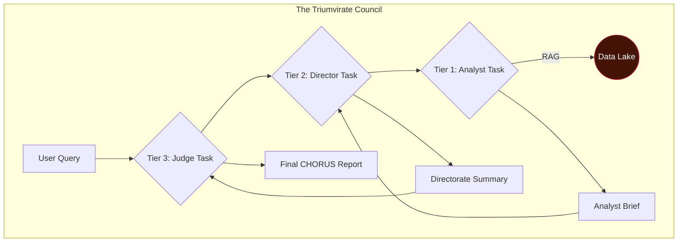

# 🔱 CHORUS: The Mission Charter

> ✨ _The loudest secrets are kept in silence. We built an engine that listens._ ✨

---

## Overview

**CHORUS** is not a search engine; it is a judgment engine. It is a fully autonomous, self-healing, and evolving intelligence platform designed to fuse disparate, open-source data verticals into high-fidelity, actionable insights.

The system was born from a simple observation: when a government research program proves its worth, it doesn't die—it "graduates" into the classified world, leaving behind a faint echo in the public record. CHORUS is designed to detect these echoes by correlating the silence in one dataset with the sudden chatter in others.

By simulating the structured, multi-layered, and adversarial analysis of a real-world intelligence agency, CHORUS moves beyond data retrieval into the realm of automated strategic judgment.

## Core Features

- **Autonomous & Self-Healing:** Built on a service-oriented architecture, the system runs 24/7, survives reboots, and automatically manages its own data and analysis queues.
- **Evolving Data Lake:** A **Sentinel** daemon perpetually and intelligently refreshes a multi-source data lake.
- **The Triumvirate Council:** A three-tiered council of AI personas (Analysts, Directors, and a Judge) debates and challenges findings to prevent groupthink and ensure intellectual rigor.
- **Verifiable Attribution:** All claims are linked to their source with clickable citations.
- **Dual-Format Export:** Generate final intelligence products as either a portable static HTML website or a professional, archival-quality PDF.

---

## System Architecture

The **Sentinel** daemon perpetually harvests data, the **Launcher** daemon perpetually analyzes it, and the Analyst commands the process through the C2 Dashboard.

### The Triumvirate Council Workflow

A user query triggers a hierarchical cascade of analysis, ensuring conclusions are rigorously tested from multiple, competing viewpoints before being finalized.



---

## Quickstart Guide

CHORUS is a complex system made simple through a unified Command Center. After cloning the repository and activating the Python virtual environment, all common tasks are handled by `make`.

### 1. Initial Setup

```bash
# Clone the repository and navigate into it
git clone <your-repo-url>
cd CHORUS

# Create and activate a Python virtual environment
python3 -m venv venv
source venv/bin/activate

# Install all dependencies
pip install -r requirements.txt

# Configure your environment
cp .env.example .env
nano .env # <-- Add your API keys and DB credentials
```

### 2. The Data-First Build Process

This process uses the Command Center (`Makefile`) to set up the entire system with a few simple commands.

```bash
# 1. Reset the database to a clean state
make db-reset

# 2. Populate the database with personas and harvester tasks
make db-populate

# 3. Download the AI embedding model (one-time setup)
make download-model

# 4. Run the full DARPA data ingestion pipeline
# (Requires raw .txt files in data/darpa/)
make ingest-darpa
```

### 3. Launch the System

```bash
# Start all services (UI, Sentinel, Launcher) in the background
make run

# Monitor the logs of the running daemons
make logs

# Stop all services
make stop
```

For more detailed contribution guidelines and the full architectural blueprint, please see the other documents in the `/docs` directory.