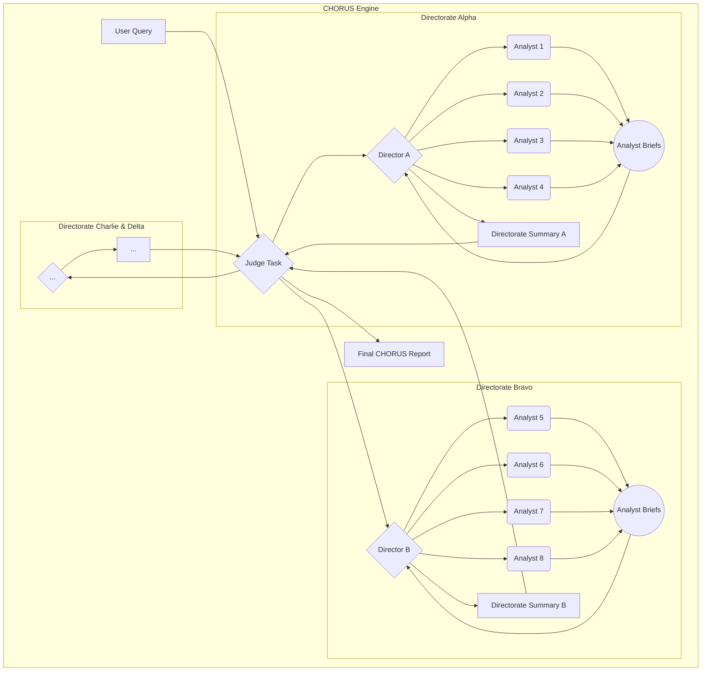

# 🔱 The CHORUS Constitution & Architectural Blueprint
_Document Version: 2.0 (Phase 2 - The Chamber Orchestra)_
_Last Updated: 2025-07-19_

---

## Part 1: The Guiding North Star (The Mission)

> ✨ The loudest secrets are kept in silence. ✨
> 
> We believe that silence is not an absence of data, but a signal in itself. A budget line vanishes into shadow. A job posting for a cleared physicist appears like a flare in the night. A cluster of obscure academic papers creates a new hum in the noise.
> 
> Our engine, CHORUS, is an observatory for these echoes. It listens to the resonance left behind when a secret program graduates from the public record, fusing the void in one dataset with the crescendo in another.
> 
> It is not a monolith; it is a symphony of judgment. An adversarial council of AI virtuosos—Hawks, Doves, Futurists, and Skeptics—each performing their own analysis, their competing melodies forged by synthesizing Directors into a single, coherent revelation.
> 
> We do not ask for an answer. We demand a verdict, complete with every source and every dissenting note, allowing you to see the work and trust the judgment.

---

## Part 2: The Axioms of CHORUS Development

_This section codifies all 18 inviolable principles. All code and architectural decisions MUST adhere to these axioms to prevent regression._

**I. Foundational Axioms (The Bedrock)**

1.  **Axiom of Mission Alignment:** The CHORUS platform overview is our guiding north star. Every feature must serve the core mission of detecting echoes of classified programs by starting with DARPA as the primary signal and dynamically tasking other OSINT verticals for fusion.
2.  **Axiom of Model Standardization:** All generative tasks will exclusively use the **`gemini-2.5-pro`** model to ensure consistency and comparability of outputs.
3.  **Axiom of Deterministic Parsing:** The AI's role is reasoning and generating clearly delineated plain text. Our Python code is solely responsible for parsing this text into reliable, guaranteed-valid data structures. We **never** instruct the LLM to return JSON.
4.  **Axiom of Schema-First Development:** The database schema is the ground truth. All code that interacts with the database must conform precisely to the established table structures, column names, and data types.
5.  **Axiom of Atomic Implementation:** All code provided must be a **complete, drop-in replacement** for the file it modifies. We do not work with partial snippets or diffs.

**II. Architectural Axioms (The Structure)**

6.  **Axiom of Adversarial Analysis:** The system's final judgment must emerge from the structured, parallel debate between multiple, competing AI personas. This is the core mechanism for preventing single-model bias and ensuring intellectual rigor.
7.  **Axiom of Hierarchical Synthesis:** Analysis is a multi-tiered process (Analyst -> Director -> Judge), with each tier adding a layer of abstraction and judgment.
8.  **Axiom of Persona-Driven Collection:** Data collection is not monolithic. Each Analyst persona is responsible for generating its **own** dynamic Collection Plan based on its unique worldview. Data gathering is an integral and biased part of the analysis itself, not a neutral preliminary step.
9.  **Axiom of Tool-Assisted Analysis:** Personas are not limited to static data. Both Analysts and Directors must have access to a defined set of external tools (e.g., Google Search) to enrich their analysis in real-time.
10. **Axiom of Pragmatic Harvesting:** A harvester's goal is to acquire a high-quality *signal*, not to exhaustively mirror a data source. All harvesting functions must have a configurable `max_results` limit to prevent unbounded collection.

**III. Verifiability & Quality Axioms (The Product)**

11. **Axiom of Atomic Attribution:** Every piece of information retrieved from an external tool must be atomically captured with its source (URL) and snippet, stored in the database, and made available for citation in the final report.
12. **Axiom of Report Conciseness:** Foundational internal data sources (like the DARPA budget database) are to be referenced once in a summary statement, not repeatedly cited.
13. **Axiom of the Contrarian (The Red Team):** At least one persona in any analysis must be tasked with constructing the most plausible, evidence-based *alternative* hypothesis to the primary query, ensuring we test for deception and "black swan" events.
14. **Axiom of Quantified Confidence:** All analytical conclusions from Analysts, Directors, and the Judge must be accompanied by a numerical confidence score to add precision and force rigorous self-assessment.

**IV. Strategic & Learning Axioms (The Vision)**

15. **Axiom of the Analytical Triumvirate:** The council is a three-tiered hierarchy: 16 Analysts, 4 Directors, and 1 final Judge.
16. **Axiom of Persona-Specialization:** Analysts are specialists in both a data vertical and a worldview.
17. **Axiom of Historical Precedent:** The Judge is compelled to ask, "Has a similar pattern of signals been observed before in history?" to add strategic depth.
18. **Axiom of Recursive Inquiry:** The `intelligence_gaps` from a final report must be used to generate new, persistent, low-priority harvesting tasks, creating an autonomous feedback loop.

---

## Part 3: The Triumvirate Architecture

_This section describes the hierarchical structure of the analytical engine._

### 3.1. The Triumvirate Council
*   **Tier 1: The Analysts (The Virtuosos):** 16 specialist personas who perform the initial deep-dive analysis. They are the "doers," each with deep expertise in a specific data vertical and a distinct worldview (e.g., a "Financial Signal Hawk").
*   **Tier 2: The Directors (The Section Leaders):** 4 director personas who synthesize the findings of their assigned 4-Analyst teams. They are the "debaters," responsible for resolving conflicts and creating a balanced directorate-level judgment.
*   **Tier 3: The Judge (The Conductor):** A single, final arbiter that synthesizes the competing directorate summaries into the definitive CHORUS report. It is the "decider," uniquely tasked with taking a long-term strategic view.

### 3.2. Architectural Diagram (The Full Symphony)

---

## Part 4: The Phased Rollout Plan & Quality Targets

_This section defines the current phase of development and the quantitative goals for success._

### 4.1. Current Phase: Phase 2 - The Chamber Orchestra
*   **Objective:** Prove that a Director, synthesizing four competing Analyst viewpoints, produces a superior report.
*   **Baseline Score (from Phase 1):** 1767.5 / 3000 (Normalized: 58.9%)
*   **Target Score (for Phase 2):** **2210 / 3000** (Normalized: ~74%)

### 4.2. Future Phases
*   **Phase 3: The Full Symphony:**
    *   **Objective:** Prove that the final Judge, synthesizing four competing Directorate summaries, produces the definitive, highest-quality intelligence product.
    *   **Baseline Score (from Phase 2):** 2210 / 3000
    *   **Target Score (for Phase 3):** **2540 / 3000** (Normalized: ~85%)

---

## Part 5: Service-Level Objectives (SLOs)

This section defines the formal performance, reliability, and security contract for the system. All components must be tested against these standards. A failure to meet an SLO is considered a bug.

*   **SLO-H1 (Harvester Speed)**

    **Objective**: Any single, dynamically generated harvesting task must complete its full execution—from process start to saving data in the Data Lake—in under 90 seconds.

    **Method of Measurement**: This will be measured by the harvester_worker.py script. The worker will record a start timestamp upon initialization and an end timestamp immediately before its final update_task_status('COMPLETED', ...) call. The duration will be logged. The trident_sentinel will be responsible for reaping any worker process that exceeds a 120-second hard timeout, marking its task as FAILED.

    **Rationale**: This ensures that the data collection phase for any given signal remains responsive and does not become a bottleneck for the Analyst's workflow.

*   **SLO-H2 (Harvester Reliability**)

    **Objective**: Any individual harvester module (e.g., usaspending_harvester) must achieve a >98% success rate on valid, well-formed queries.

    **Method of Measurement**: This will be measured by our dedicated stress test scripts (e.g., stress_test_usaspending.py). The test will consist of at least 100 sequential, valid requests. A "success" is defined as a 200 OK HTTP status code. The test fails if the success rate drops below 98%.

    **Rationale**: This guarantees that our core data collection tools are robust and that failures are rare and exceptional, allowing our "Graceful Degradation" policy to be a last resort, not a common occurrence.

*   **SLO-A1 (Analyst Speed)**

    **Objective**: A single persona_worker (Analyst) must complete its full Plan -> Harvest -> Synthesize cycle in under 5 minutes (300 seconds) for a standard query.

    **Method of Measurement**: This is measured by the trident_launcher.py daemon. The started_at and completed_at timestamps in the task_queue table for any Analyst-level task will be used to calculate the total duration. The launcher's check_and_reset_stale_tasks function will enforce a hard timeout of 10 minutes, as a safety measure.

    **Rationale**: This ensures a timely response for the user. While deep analysis takes time, the core loop for a single Analyst must be efficient enough to enable the multi-persona "Chamber Orchestra" to complete its work in a reasonable timeframe (e.g., under 15-20 minutes).

*  SLO-S1 (Security & Anonymity)

    **Objective**: The system must not store any Personally Identifiable Information (PII) or system-specific identifiers (e.g., hostnames, usernames) in the database or logs.

    **Method of Measurement**: This is enforced through code review and static analysis. All pull requests will be checked to ensure:

      Worker IDs are generated using a random method (e.g., uuid.uuid4()).

      User-Agent strings in harvesters are generic and do not contain personal information like emails.

      No code attempts to access or store system-level user or host information.

    **Rationale**: This is a foundational security and privacy requirement. It minimizes the operational security footprint of the system and protects the privacy of its operators.

*   SLO-Q1 (Quality Improvement)

    **Objective**: Each hierarchical tier of the Triumvirate Council must produce a demonstrably superior intelligence product compared to the tier below it.

    **Method of Measurement**: This is measured by the ab_test_judger.py script and its council of LLM judges.

      **Phase 2 Goal**: The Directorate Summary score must be ≥ 1.25x the score of the best single Analyst report.

      **Phase 3 Goal**: The final Judge's Report score must be ≥ 1.15x the score of the best Directorate Summary.

    **Rationale**: This is the ultimate measure of the system's value. It provides a quantitative, objective answer to the question, "Does our adversarial, hierarchical architecture actually produce a better result?" It is the core driver for the entire project.

---

## Part 6: The Harvester Forge (Future Vision)

_This section documents our long-term vision for the system's self-generation capabilities, guiding future architectural choices._

The ultimate vision is to create a **Harvester Refactoring Engine**. This is not a system that writes code from scratch, but a pragmatic, template-based engine that allows the system to build new harvesters with minimal human intervention.

**The Workflow:**
1.  **Manual Creation & Pattern Discovery:** We will first manually build a dozen robust harvesters, identifying the core functional elements common to all of them (authentication, request logic, pagination, parsing).
2.  **Decomposition and Templating:** We will then refactor these into a `generic_harvester_template.py` file, replacing specific implementations with placeholders (e.g., `{{API_HOST}}`, `{{RESULTS_LIST_KEY}}`).
3.  **LLM-Powered Configuration:** A user will provide the API documentation for a new source. An LLM will be tasked not with writing code, but with reading the documentation and outputting a JSON object that contains the correct values for all the placeholders in the template.
4.  **Deterministic Code Generation:** A Python script will then perform a simple, reliable string replacement on the template using the LLM-generated JSON, producing a complete, syntactically correct new harvester script.
5.  **Sandbox Validation:** The new script will be automatically run in a secure sandbox to validate its functionality before being presented to a human developer for final approval via a pull request.
