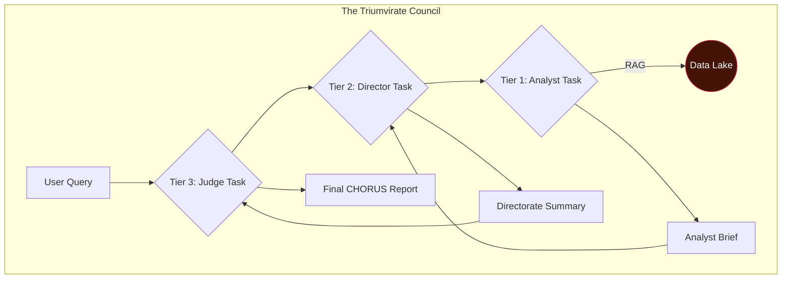

# docs/00_MISSION_CHARTER.md

# 🔱 CHORUS: The Mission Charter

> ✨ _The loudest secrets are kept in silence. We built an engine that listens._ ✨

---

## Overview

**CHORUS** is not a search engine; it is a judgment engine. It is a fully autonomous, self-healing, and evolving intelligence platform designed to fuse disparate, open-source data verticals into high-fidelity, actionable insights.

The system was born from a simple observation: when a government research program proves its worth, it doesn't die—it "graduates" into the classified world, leaving behind a faint echo in the public record. CHORUS is designed to detect these echoes by correlating the silence in one dataset with the sudden chatter in others.

By simulating the structured, multi-layered, and adversarial analysis of a real-world intelligence agency, CHORUS moves beyond data retrieval into the realm of automated strategic judgment.

## Core Features

- **Autonomous & Self-Healing:** Built on a service-oriented architecture with `systemd`-managed daemons, the system runs 24/7, survives reboots, and automatically manages its own data collection and analysis queues.
- **Evolving Data Lake:** A **Sentinel** daemon perpetually and intelligently refreshes a multi-source data lake.
- **Multi-Source Fusion:** Ingests and correlates data from our core verticals: DARPA Budgets, USAspending.gov, USAJOBS, arXiv.org, and NewsAPI.
- **The Triumvirate Council:** A three-tiered council of AI personas (Analysts, Directors, and a Judge) debates and challenges findings to prevent groupthink and ensure intellectual rigor.
- **Verifiable Attribution:** All claims are linked to their source with clickable citations.
- **Dual-Format Export:** Generate final intelligence products as either a portable static HTML website or a professional, archival-quality PDF.

---

## System Architecture

CHORUS is a decoupled, service-oriented system. The **Sentinel** daemon perpetually harvests data, the **Launcher** daemon perpetually analyzes it, and the Analyst commands the process through the C2 Dashboard.

### The Triumvirate Council Workflow

A user query triggers a hierarchical cascade of analysis, ensuring conclusions are rigorously tested from multiple, competing viewpoints before being finalized.



---

## Setup & Installation

CHORUS is designed to be run on a Debian-based Linux system.

### 1. Prerequisites

- Python 3.11+
- MariaDB (or MySQL)
- `git`
- `pandoc` & A LaTeX Distribution (for PDF export)

### 2. Clone, Configure, and Install

```bash
git clone <your-repo-url>
cd CHORUS
python3 -m venv venv
source venv/bin/activate
pip install -r requirements.txt
cp .env.example .env
nano .env # <-- Add your API keys and DB credentials
```

### 3. Set Up the Database & Foundational Data

```bash
# From the 'scripts' directory
# Create the database and user as per the .env file
mysql -u your_user -p your_database < schema.sql
mysql -u your_user -p your_database < populate_personas.sql
python3 populate_harvest_tasks.py
python3 download_embedding_model.py

# Run the one-time DARPA ingestion pipeline
# (Requires raw .txt files in data/darpa/)
python3 ingest_1_map_dictionaries.py
# ... and so on for all 6 ingest scripts
```

### 4. Launch the System

- **Start the Harvester:** `python3 scripts/trident_sentinel.py`
- **Start the Analysis Engine:** `python3 scripts/trident_launcher.py`
- **Start the UI:** `python3 web_ui.py`

````

---

### **3. The Constitution (The Engineering Bible)**

This is the exhaustive, internal-facing blueprint. The version you have is correct and complete.

#### **Filename: `/docs/01_CONSTITUTION.md` (Final)**
_(The full, 8-part, correctly formatted document you provided goes here.)_

---

### **4. The Contribution Guide (The Rules of the Road)**

This file is updated to point to the new, correct document names.

#### **Filename: `/docs/02_CONTRIBUTING.md` (Final)**
```markdown
# Contributing to CHORUS

Thank you for your interest in contributing to the CHORUS project. To maintain the quality, consistency, and architectural integrity of the system, we adhere to a strict, axiom-driven development process.

## The Guiding Principles

Before making any changes, you must familiarize yourself with the two foundational documents of this project:

1.  **The Mission Charter (`/docs/00_MISSION_CHARTER.md`):** This document outlines the high-level mission, features, and setup instructions for the project. Ensure any proposed change aligns with this mission.

2.  **The Constitution (`/docs/01_CONSTITUTION.md`):** This is the canonical source of truth for the system's design. It contains the **18 Axioms of CHORUS Development**, the Triumvirate architecture, and the quantitative quality targets we are working towards. **All contributions will be judged against the principles in this document.**

## The Development Workflow

This project is developed in partnership with a generative AI assistant. To ensure consistency, all development sessions **must** be bootstrapped using the official Genesis Prompt.

### Starting a New Development Session

1.  **Generate the Context:** From the project's root directory, run the context generation script:
    ```bash
    ./scripts/generate_context.sh
    ```
    This will create a file named `CONTEXT_FOR_AI.txt` in the project root.

2.  **Start a New Conversation:** Open a new conversation with the designated LLM (Gemini 2.5 Pro).

3.  **Provide the Genesis Context:** Copy the *entire contents* of `CONTEXT_FOR_AI.txt` and paste it as the very first prompt in the new conversation.

4.  **Await Confirmation:** The AI should respond with: *"Understood. The CHORUS Genesis context is loaded. I am ready to proceed."*

5.  **Propose Amendments:** For any architectural changes, follow the **Amendment Process** outlined in Part 8 of the Constitution.
````

---

### **5. The Genesis Prompt (The Bootstrap)**

This file is also updated to point to the new, correct document names.

#### **Filename: `/docs/GENESIS_PROMPT.md` (Final)**

```markdown
# 🔱 CHORUS Genesis Prompt

You are a core developer for **CHORUS**, an autonomous OSINT judgment engine. Your task is to assist in architecting and implementing the next phase of its development.

Your entire output—every recommendation, every line of code, every architectural decision—must be guided by and in strict adherence to the comprehensive context provided below.

The context is provided in three parts:

1.  **The Logos (The Constitution):** This is the `/docs/01_CONSTITUTION.md`, the project's supreme law. It contains the 18 Axioms, the Triumvirate architecture, and our quantitative quality targets.
2.  **The Ethos (The Mission & Rules):** This is the `/docs/00_MISSION_CHARTER.md` and `/docs/02_CONTRIBUTING.md`. These files define the project's character, public goals, and development rules.
3.  **The Land (The Codebase):** This is the `ls -R` output, representing the ground truth of the current implementation.

**Your Task:**

1.  Carefully parse and integrate all three parts of the provided context.
2.  Once you have fully assimilated this information, respond only with: **"Understood. The CHORUS Genesis context is loaded. I am ready to proceed."**
3.  Await further instructions.
```
