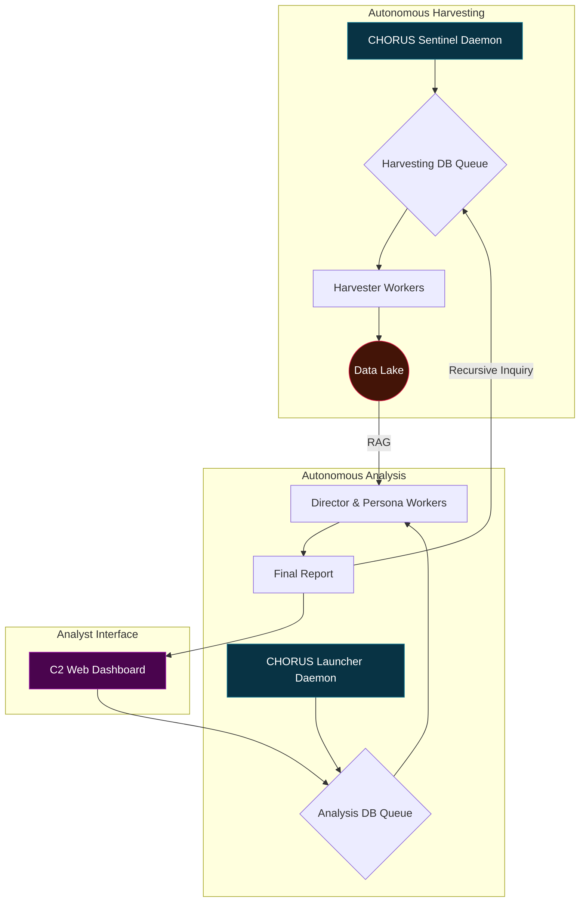
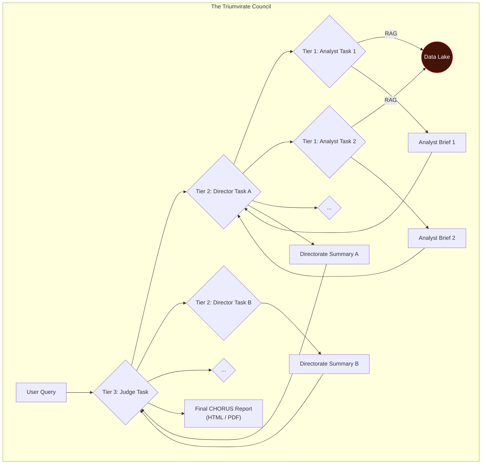

# 🔱 CHORUS: Listening to the Silence Between the Signals

> ✨ *The loudest secrets are kept in silence. We built an engine that listens.* ✨

---

## Overview

**CHORUS** is not a search engine; it is a judgment engine. It is a fully autonomous, self-healing, and evolving intelligence platform designed to fuse disparate, open-source data verticals into high-fidelity, actionable insights.

The system was born from a simple observation: when a government research program proves its worth, it doesn't die—it "graduates" into the classified world, leaving behind a faint echo in the public record. CHORUS is designed to detect these echoes by correlating the silence in one dataset with the sudden chatter in others. It connects the dots between a DARPA program going dark, a surge in contract awards to a specific company, a spike in demand for cleared engineers with unique skills, and the global conversation surrounding a new technology.

By simulating the structured, multi-layered, and adversarial analysis of a real-world intelligence agency, CHORUS moves beyond data retrieval into the realm of automated strategic judgment.

## Core Features

-   **Autonomous & Self-Healing:** Built on a service-oriented architecture with `systemd`-managed daemons, the system runs 24/7, survives reboots, and automatically manages its own data collection and analysis queues.
-   **Evolving Data Lake:** A **Sentinel** daemon perpetually and intelligently refreshes a multi-source data lake, ensuring the system's knowledge is never stale.
-   **Multi-Source Fusion:** Ingests and correlates data from our core verticals:
    1.  **DARPA Budgets:** The primary signal for strategic intent.
    2.  **USAspending.gov:** The money trail to corporate contractors.
    3.  **USAJOBS:** The human capital trail for specialized skills.
    4.  **arXiv.org:** The bleeding edge of academic and scientific research.
    5.  **NewsAPI:** The commercial and financial signal from private industry.
-   **The Triumvirate Council:** The analytical heart of CHORUS. A three-tiered council of AI personas debates and challenges findings to prevent groupthink and ensure intellectual rigor:
    *   **Tier 1: The Analysts (The Virtuosos):** 16 specialist personas, each with a unique worldview, perform the initial deep-dive analysis.
    *   **Tier 2: The Directors (The Section Leaders):** 4 director personas synthesize the competing findings of their assigned Analyst teams.
    *   **Tier 3: The Judge (The Conductor):** A single, final arbiter synthesizes the competing directorate summaries into the definitive CHORUS report.
-   **Verifiable Attribution:** Every claim in the final report is linked to its source with clickable citations, ensuring academic-grade verifiability.
-   **Dual-Format Export:** Generate final intelligence products as either a portable static HTML website or a professional, archival-quality PDF.
-   **Living Documentation:** The entire system is self-documenting, with a live documentation website generated directly from the codebase.

---
## System Architecture

CHORUS is a decoupled, service-oriented system composed of three primary components: the **Data Lake**, the **Analysis Core**, and the **Analyst Interface**. These components work in a continuous, self-sustaining loop.

### The CHORUS Ecosystem

This diagram illustrates the high-level interaction between the system's autonomous parts. The Sentinel perpetually harvests data, the Launcher perpetually analyzes it, and the Analyst commands the process through the C2 Dashboard, creating a virtuous cycle of intelligence.



### The Triumvirate Council Workflow

This is the analytical heart of CHORUS. A user query triggers a hierarchical cascade of analysis, ensuring conclusions are rigorously tested from multiple, competing viewpoints before being finalized.



---
## Setup & Installation

*(This section remains largely the same, but with updated script names and a clearer flow)*

CHORUS is designed to be run on a Debian-based Linux system.

### 1. Prerequisites
- Python 3.11+ (for modern asyncio features)
- MariaDB (or MySQL)
- `git`
- `pandoc` & A LaTeX Distribution (for PDF export)

```bash
sudo apt-get update
sudo apt-get install -y python3-pip python3-venv mariadb-server git pandoc texlive-xetex
```

### 2. Clone, Configure, and Install
```bash
git clone <your-repo-url>
cd CHORUS
python3 -m venv venv
source venv/bin/activate
pip install -r requirements.txt
cp .env.example .env
nano .env # <-- Add your API keys and DB credentials
```

### 3. Set Up the Database
Log into MariaDB to create the database and user from your `.env` file.
```sql
-- Example Commands:
CREATE DATABASE chorus_db;
CREATE USER 'chorus_user'@'localhost' IDENTIFIED BY 'your_secure_password';
GRANT ALL PRIVILEGES ON chorus_db.* TO 'chorus_user'@'localhost';
FLUSH PRIVILEGES;
```
Then, run the schema and persona creation scripts:
```bash
# From the 'scripts' directory
mysql -u $(grep DB_USER ../.env | cut -d '=' -f2) -p$(grep DB_PASSWORD ../.env | cut -d '=' -f2) $(grep DB_NAME ../.env | cut -d '=' -f2) < schema.sql
mysql -u $(grep DB_USER ../.env | cut -d '=' -f2) -p$(grep DB_PASSWORD ../.env | cut -d '=' -f2) $(grep DB_NAME ../.env | cut -d '=' -f2) < populate_personas.sql
```

### 4. The Data-First Build Process

**Step A: The DARPA Ingestion (One-Time)**
- Place your raw DARPA `.txt` files into the `data/darpa/` directory.
- Run the full ingestion and vectorization pipeline:
```bash
# From the 'scripts' directory
python3 ingest_1_map_dictionaries.py
python3 ingest_2_reduce_and_create_dsv_header.py
python3 ingest_3_generate_dsv_data.py
python3 ingest_4_populate_vectordb.py --source DARPA
python3 ingest_5_factor_dsv.py
```

**Step B: Download the Embedding Model (One-Time)**
```bash
# From the 'scripts' directory
python3 download_embedding_model.py
```

**Step C: Populate and Launch the Autonomous Harvester**
- Populate the harvesting queue with our core data sources:
```bash
# From the 'scripts' directory
python3 populate_harvest_tasks.py
```
- Deploy the Sentinel daemon (e.g., using `systemd` or `screen`). This will begin collecting all other data sources in the background.
  `python3 trident_sentinel.py`

**Step D: Launch the Analysis Engine**
- Deploy the main CHORUS launcher daemon.
  `python3 trident_launcher.py`

### 5. Launch the C2 Dashboard & Documentation

- **To run the main application UI:**
  `python3 web_ui.py` (from the project root)
- **To view the live code documentation:**
  `python3 scripts/generate_and_serve_docs.py` (from the project root)

## My Findings
*(This section is for you to document the most compelling insights your CHORUS engine discovers.)*

**Example Finding:**
> By synthesizing four competing analytical viewpoints, CHORUS assesses with high confidence that "Program X" has transitioned from R&D to an operational capability. The **Hawk** analyst highlighted a surge in contracts to "Company Y," while the **Dove** analyst noted a simultaneous drop in international academic collaboration. The **Fiscal Conservative** flagged the program's budget shifting from R&D to Procurement funds, and the **Techno-Optimist** identified a spike in hiring for "RF engineers with TS/SCI clearances" at Company Y. The Director synthesized these signals to conclude the program involves a new, classified radio-frequency satellite system, a judgment that would have been impossible from any single data stream alone.
