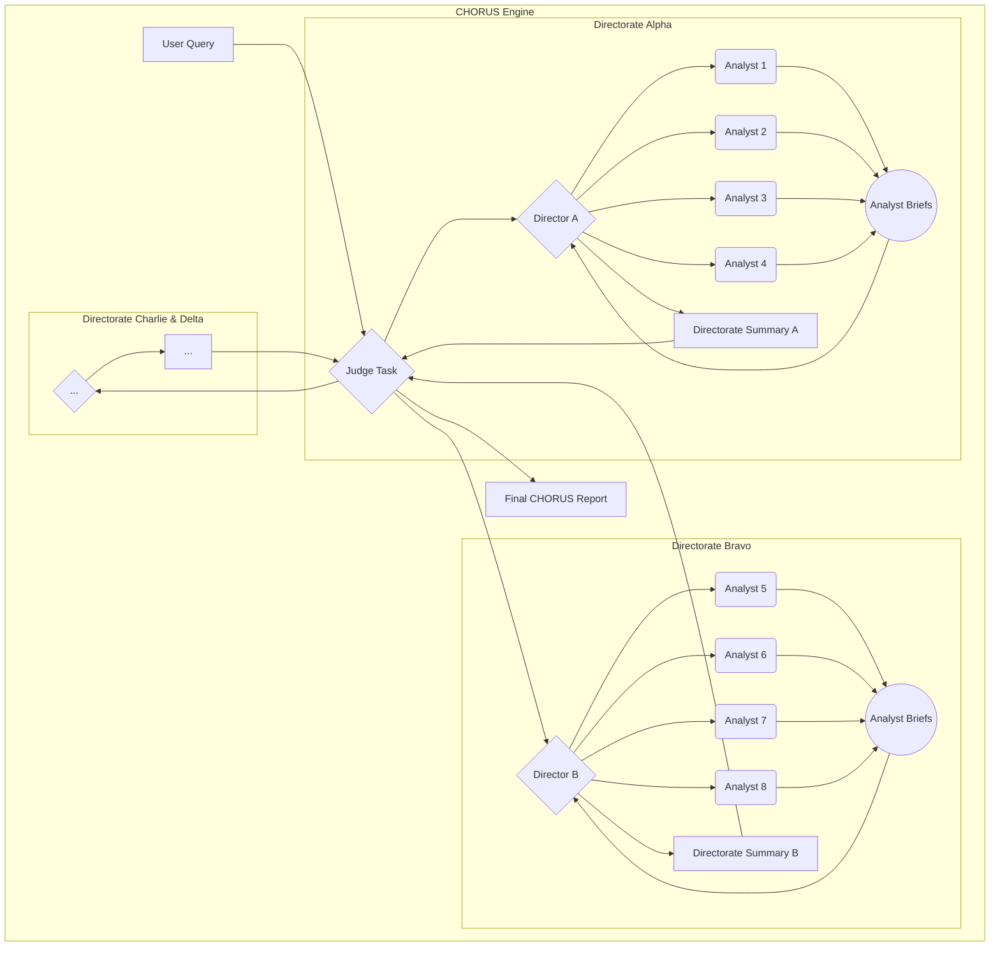

# docs/01_CONSTITUTION.md

# 🔱 The CHORUS Constitution & Architectural Blueprint

_Document Version: 2.0 (Phase 2 - The Chamber Orchestra)_
_Last Updated: 2025-07-19_

---

## Part 1: The Guiding North Star (The Mission)

> ✨ The loudest secrets are kept in silence. ✨
>
> We believe that silence is not an absence of data, but a signal in itself. A budget line vanishes into shadow. A job posting for a cleared physicist appears like a flare in the night. A cluster of obscure academic papers creates a new hum in the noise.
>
> Our engine, CHORUS, is an observatory for these echoes. It listens to the resonance left behind when a secret program graduates from the public record, fusing the void in one dataset with the crescendo in another.
>
> It is not a monolith; it is a symphony of judgment. An adversarial council of AI virtuosos—Hawks, Doves, Futurists, and Skeptics—each performing their own analysis, their competing melodies forged by synthesizing Directors into a single, coherent revelation.
>
> We do not ask for an answer. We demand a verdict, complete with every source and every dissenting note, allowing you to see the work and trust the judgment.

---

## **Part 2: The Axioms of CHORUS Development (Definitive Version)**

_This section codifies all 21 inviolable principles. All code and architectural decisions MUST adhere to these axioms._

---

### **I. Foundational Axioms (The Bedrock)**

1.  **Axiom of Mission Alignment:**
    *   **Principle:** The CHORUS platform's "Guiding North Star" is its core mission.
    *   **Definition:** Every feature, architectural decision, and line of code must directly serve the primary mission: to detect the echoes left by classified programs by starting with DARPA as the primary signal and dynamically fusing it with other open-source data verticals. Any proposed change will first be judged by its contribution to this mission.

2.  **Axiom of Tiered Modeling:**
    *   **Principle:** The system must use the right tool for the right job.
    *   **Definition:** The system will use a tiered approach to LLM selection, routing tasks to the appropriate model based on complexity. A faster, cost-effective **Utility Model** will be used for high-volume, structured data tasks, while a high-capability **Synthesis Model** will be used for complex reasoning and final report generation.

3.  **Axiom of Deterministic Control:**
    *   **Principle:** The AI reasons; the code executes.
    *   **Definition:** The AI's role is to perform complex reasoning and generate clearly delineated plain text. Our Python code is solely responsible for all deterministic logic, including parsing the AI's output, managing the system's state, and generating final data structures. We do not delegate critical control flow or data formatting to the probabilistic LLM.

4.  **Axiom of Schema-First Development:**
    *   **Principle:** The database is the ground truth of the system's state.
    *   **Definition:** The database schema is the formal contract for all data within the system. All code that interacts with the database must conform precisely to the established table structures, column names, and data types as defined in `schema.sql`.

5.  **Axiom of Atomic Implementation:**
    *   **Principle:** Development must be clean, complete, and verifiable.
    *   **Definition:** All code provided during development must be a **complete, drop-in replacement** for the file it modifies. We do not work with partial snippets or diffs, ensuring that every step results in a fully functional and testable state.

---

### **II. Architectural Axioms (The Structure)**

6.  **Axiom of Adversarial Analysis:**
    *   **Principle:** Truth emerges from structured, intellectual conflict.
    *   **Definition:** The system's final judgment must emerge from the structured, parallel debate between multiple, competing AI personas. This is the core architectural mechanism for preventing single-model bias, surfacing hidden assumptions, and ensuring that conclusions are rigorously tested from multiple viewpoints.

7.  **Axiom of Hierarchical Synthesis:**
    *   **Principle:** Analysis is a process of increasing abstraction.
    *   **Definition:** The system is structured as a multi-tiered hierarchy (Analyst -> Director -> Judge). Each tier's function is to synthesize the outputs of the tier below it, adding a new layer of abstraction, resolving conflicts, and increasing the strategic value of the product.

8.  **Axiom of Persona-Driven Collection:**
    *   **Principle:** Data collection is an act of analysis, not a neutral precursor.
    *   **Definition:** Data collection is not monolithic. Each Analyst persona is responsible for generating its **own** dynamic Collection Plan based on its unique worldview. The choice of what data to collect is a biased and integral part of the analytical process itself.

9.  **Axiom of Tool-Assisted Analysis:**
    *   **Principle:** Agents are not limited to the static Data Lake.
    *   **Definition:** Personas must have access to a defined set of external tools (e.g., Google Search) to enrich their analysis, validate findings, and resolve ambiguities in real-time, simulating the workflow of a real-world analyst.

10. **Axiom of Pragmatic Harvesting:**
    *   **Principle:** The goal is signal, not exhaustive collection.
    *   **Definition:** A harvester's purpose is to acquire a high-quality *signal*, not to exhaustively mirror a data source. All harvesting functions must have a configurable `max_results` limit to prevent unbounded collection, ensuring the system remains responsive and focused on the most relevant data.

---

### **III. Verifiability & Quality Axioms (The Product)**

11. **Axiom of Atomic Attribution:**
    *   **Principle:** Every external fact must be verifiable.
    *   **Definition:** Every piece of information retrieved from an external tool must be atomically captured with its source (URL) and the relevant snippet. This data must be stored persistently and made available for citation in the final report, ensuring every claim can be traced back to its origin.

12. **Axiom of Report Conciseness:**
    *   **Principle:** The final report must be clear and to the point.
    *   **Definition:** Foundational internal data sources (like the DARPA budget database) are to be referenced once in a summary statement, not repeatedly cited. The focus of the report is the *synthesis* of new information, not the enumeration of the baseline.

13. **Axiom of the Contrarian:**
    *   **Principle:** The system must challenge the user's premise.
    *   **Definition:** At least one persona in any analysis must be tasked with constructing the most plausible, evidence-based *alternative* hypothesis to the primary query. This ensures we actively test for deception, misinterpretation, and "black swan" events.

14. **Axiom of Quantified Confidence:**
    *   **Principle:** All judgments must be expressed with precision.
    *   **Definition:** All analytical conclusions from Analysts, Directors, and the Judge must be accompanied by a numerical confidence score. This forces a rigorous self-assessment of the evidence and adds a critical layer of precision to the final product.

---

### **IV. Strategic & Learning Axioms (The Vision)**

15. **Axiom of the Analytical Triumvirate:**
    *   **Principle:** The system's structure is a three-tiered council.
    *   **Definition:** The analytical engine is formally defined as a three-tiered hierarchy: 16 **Analysts** (the doers), 4 **Directors** (the debaters), and 1 final **Judge** (the decider). This structure is the foundation of our phased rollout plan.

16. **Axiom of Persona-Specialization:**
    *   **Principle:** Agents are experts, not generalists.
    *   **Definition:** To ensure analytical depth, Analyst personas are defined by two axes: their **worldview** (e.g., Hawk, Dove) and their **domain expertise** (e.g., Financial Signal Analysis, Human Capital Analysis). This creates a matrix of specialized experts.

17. **Axiom of Historical Precedent:**
    *   **Principle:** The past is prologue.
    *   **Definition:** The final Judge persona is constitutionally compelled to ask, "Has a similar pattern of financial, human, and narrative signals been observed before in history?" This forces the use of historical case studies to add strategic depth and prevent analytical myopia.

18. **Axiom of Recursive Inquiry:**
    *   **Principle:** The system must learn from its own conclusions.
    *   **Definition:** The `intelligence_gaps` identified in a final report are not merely informational; they must be automatically parsed and used to generate new, persistent, low-priority harvesting tasks. This creates an autonomous feedback loop, allowing the system to passively monitor for signals that will fill its own knowledge gaps over time.

19. **Axiom of Dialectic Rigor:**
    *   **Principle:** Analysis is a dialogue, not a monologue.
    *   **Definition:** Before any analytical product is elevated to a higher tier, it must first be subjected to a structured, attributed critique by its peers. This peer-review process is a mandatory step to challenge assumptions, expose biases, and increase the rigor of the final product.

20. **Axiom of Internal Challenge:**
    *   **Principle:** The system must actively seek its own points of failure.
    *   **Definition:** A formal, internal Red Team, embodied by the "Devil's Advocate" persona, must be constitutionally embedded at key synthesis stages. Its purpose is not to offer an alternative conclusion, but to deconstruct the primary argument and expose its weakest points, ensuring the final report is robust and has survived a dedicated attempt at falsification.

21. **Axiom of Meta-Cognitive Evolution:**
    *   **Principle:** The system must be a learning organization.
    *   **Definition:** The system must have the capacity to reflect on its own performance over time and propose amendments to its own cognitive and analytical processes. The personas are not static; they are dynamic models that must evolve based on a quantitative and qualitative analysis of their successes and failures.
---

## Part 3: The Triumvirate Architecture

_This section describes the hierarchical structure of the analytical engine._

### 3.1. The Triumvirate Council

- **Tier 1: The Analysts (The Virtuosos):** 16 specialist personas who perform the initial deep-dive analysis. They are the "doers," each with deep expertise in a specific data vertical and a distinct worldview (e.g., a "Financial Signal Hawk").
- **Tier 2: The Directors (The Section Leaders):** 4 director personas who synthesize the findings of their assigned 4-Analyst teams. They are the "debaters," responsible for resolving conflicts and creating a balanced directorate-level judgment.
- **Tier 3: The Judge (The Conductor):** A single, final arbiter that synthesizes the competing directorate summaries into the definitive CHORUS report. It is the "decider," uniquely tasked with taking a long-term strategic view.

### 3.2. Architectural Diagram (The Full Symphony)



---

## Part 4: The Phased Rollout Plan & Quality Targets

_This section defines the current phase of development and the quantitative goals for success._

### 4.1. Current Phase: Phase 2 - The Chamber Orchestra

- **Objective:** Prove that a Director, synthesizing four competing Analyst viewpoints, produces a superior report.
- **Baseline Score (from Phase 1):** `1767.5 / 3000` (Normalized: 58.9%)
- **Target Score (for Phase 2):** **`2210 / 3000`** (Normalized: ~74%)

### 4.2. Future Phases

- **Phase 3: The Full Symphony:**
  - **Objective:** Prove that the final Judge, synthesizing four competing Directorate summaries, produces the definitive, highest-quality intelligence product.
  - **Baseline Score (from Phase 2):** `2210 / 3000`
  - **Target Score (for Phase 3):** **`2540 / 3000`** (Normalized: ~85%)

---

## Part 5: Service-Level Objectives (SLOs) & Measurement Standards

_This section defines the formal performance, reliability, and security contract for the system. All components must be tested against these standards. A failure to meet an SLO is considered a bug._

- **SLO-H1 (Harvester Speed):** Any single, dynamically generated harvesting task must complete its full execution in under **90 seconds**. This is measured by the `harvester_worker` from initialization to final status update.
- **SLO-H2 (Harvester Reliability):** Any individual harvester module must achieve a **>98% success rate** on valid, well-formed queries, as measured by its dedicated stress test script.
- **SLO-A1 (Analyst Speed):** A single `persona_worker` must complete its full Plan -> Harvest -> Synthesize cycle in under **5 minutes (300 seconds)** for a standard query. This is measured by the `trident_launcher` via the `task_queue` timestamps.
- **SLO-S1 (Security & Anonymity):** The system must not store any PII or system-specific identifiers in logs or the database. This is enforced through code review and static analysis.
- **SLO-Q1 (Quality Improvement):** Each hierarchical tier must produce a demonstrably superior product. This is measured by the `ab_test_judger.py` script.
  - **Phase 2 Goal:** Directorate Summary score must be **≥ 1.25x** the score of the best single Analyst report.
  - **Phase 3 Goal:** Final Judge's Report score must be **≥ 1.15x** the score of the best Directorate Summary.

---

## Part 6: The Harvester Forge (Future Vision)

_This section documents our long-term vision for the system's self-generation capabilities, guiding future architectural choices._

The ultimate vision is to create a **Harvester Refactoring Engine**. This is not a system that writes code from scratch, but a pragmatic, template-based engine that allows the system to build new harvesters with minimal human intervention.

**The Workflow:**

1.  **Manual Creation & Pattern Discovery:** We will first manually build a dozen robust harvesters, identifying the core functional elements common to all of them.
2.  **Decomposition and Templating:** We will then refactor these into a `generic_harvester_template.py` file, replacing specific implementations with placeholders (e.g., `{{API_HOST}}`).
3.  **LLM-Powered Configuration:** A user will provide the API documentation for a new source. An LLM will be tasked with reading the documentation and outputting a JSON object that contains the correct values for all the placeholders.
4.  **Deterministic Code Generation:** A Python script will then perform a simple, reliable string replacement on the template using the LLM-generated JSON, producing a complete, syntactically correct new harvester script.
5.  **Sandbox Validation:** The new script will be automatically run in a secure sandbox to validate its functionality before being presented to a human developer for final approval via a pull request.

---

## Part 7: Codebase Architecture & File Manifest

_This section provides a definitive map of the CHORUS repository, linking architectural concepts to their concrete file implementations._

### 7.1. Core Application Logic (`/scripts/`)

- **Daemons (The "Heartbeat"):**
  - `trident_launcher.py`: The master daemon for the analysis engine. Launches and manages worker processes.
  - `trident_sentinel.py`: The master daemon for the harvesting engine. Manages the harvester worker pool.
- **Workers (The "Brains"):**
  - `persona_worker.py`: The implementation of a **Tier 1 Analyst**.
  - `director_worker.py`: (To be built in Phase 2) The implementation of a **Tier 2 Director**.
  - `harvester_worker.py`: The generic worker for all data collection tasks.
- **Harvester Modules (The "Hands"):**
  - `usaspending_harvester.py`
  - `usajobs_harvester.py`
  - `newsapi_harvester.py`
  - `arxiv_harvester.py`
- **Core Utilities:**
  - `db_connector.py`: Manages all database connections.
  - `personas.py`: The central library defining all AI personas.

### 7.2. Setup & Configuration

- **Project Root:**
  - `.env.example`: Template for all required environment variables.
  - `requirements.txt`: List of all Python dependencies.
  - `setup.py`: Defines the project as a Python package.
- **Database Setup (`/scripts/`):**
  - `schema.sql`: The definitive schema for the MariaDB database.
  - `populate_personas.sql`: Populates the `personas` table.
  - `populate_harvest_tasks.py`: Seeds the `harvesting_tasks` table.
- **Data Ingestion (`/scripts/ingest_*.py`):**
  - A six-script pipeline for processing raw DoD budget documents into the vectorized RAG database.
- **Model Setup (`/scripts/`):**
  - `download_embedding_model.py`: Utility to download the sentence-transformer model.

### 7.3. User Interface

- `web_ui.py`: The main Flask application for the C2 dashboard.
- `/scripts/templates/`: Directory containing all Jinja2 HTML templates and static assets.

### 7.4. Documentation & Testing

- **Documentation:**
  - `/README.md`: The public-facing "Front Door" of the project.
  - `/docs/00_MISSION_CHARTER.md`: The inspirational "Why" of the project.
  - `/docs/01_CONSTITUTION.md`: This document—the definitive "Engineering Bible."
  - `/docs/02_CONTRIBUTING.md`: The "Rules of the Road" for developers.
  - `/docs/GENESIS_PROMPT.md`: The master prompt for bootstrapping development sessions.
- **Testing & Validation:**
  - `/scripts/test_*.py`: The suite of unit and performance tests for our core modules.
  - `/scripts/ab_test_judger.py`: The definitive tool for quantitatively measuring system quality.

---

## Part 8: The Amendment Process (Governing Change)

_This section defines the formal process for modifying the CHORUS architecture. Its purpose is to ensure that all changes are deliberate, documented, and aligned with the project's foundational axioms._

### 8.1. The Principle of Proportionality

- **Category 1: Bug Fixes & Minor Refinements:**
  - **Definition:** Changes that do not alter the core logic or architecture as defined in this blueprint (e.g., fixing a typo, improving performance, UI tweaks).
  - **Process:** Submit a standard pull request with a clear description of the fix.
- **Category 2: Architectural Amendments:**
  - **Definition:** Changes that **do** alter the core logic, add a new component, or modify a process described in this blueprint (e.g., adding a new worker type, changing a database schema).
  - **Process:** These changes require a formal **Amendment Proposal** within the pull request.

### 8.2. The Amendment Proposal Workflow

1.  **The Proposal:** The contributor opens a pull request. The description **must** begin with the following template:

    ```markdown
    ---
    **Amendment Proposal: [A short, descriptive title for the change]**
    
    **1. The "Why" (The Problem):**
    (A clear, concise description of the problem being solved or the capability being added.)
    
    **2. The "What" (The Proposed Change):**
    (A high-level description of the proposed architectural change.)
    
    **3. The Blueprint Impact:**
    (A list of the specific sections of `/docs/01_CONSTITUTION.md` that will need to be updated to reflect this change.)
    ---
    ```

2.  **The Review:** The lead architect and stakeholders review the proposal's architectural merits within the pull request comments.
3.  **The Implementation:** Once the proposal is approved, the contributor pushes the code and the corresponding updates to the Constitution file.
4.  **The Final Merge:** The pull request is only merged after the proposal is approved, the code is complete, the Constitution is updated, and all automated CI/CD checks have passed.
